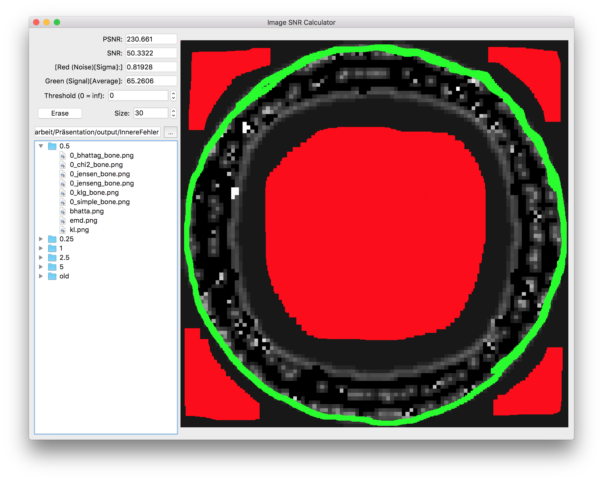

# image-snr
Qt user interface to manually segment and calculate signal-noise ratios.

I quickly threw this tool together for my bachelor thesis, to objectively assess the visibility of features in an image.
Takes greyscale values of a scaled (750x750) image. Does not classify anything and requires almost fully manual segmentation.

The displayed values are the arithmetic mean of the signal, the standard deviation of the noise, the signal-to-noise ratio (SNR) and the peak signal-to-noise ratio (PSNR). These are calculated as follows:

-\overline{N}}{s_N})

where _S_ and _N_ are the set of the greyscale values of the green and red coloured pixels (respectively).

